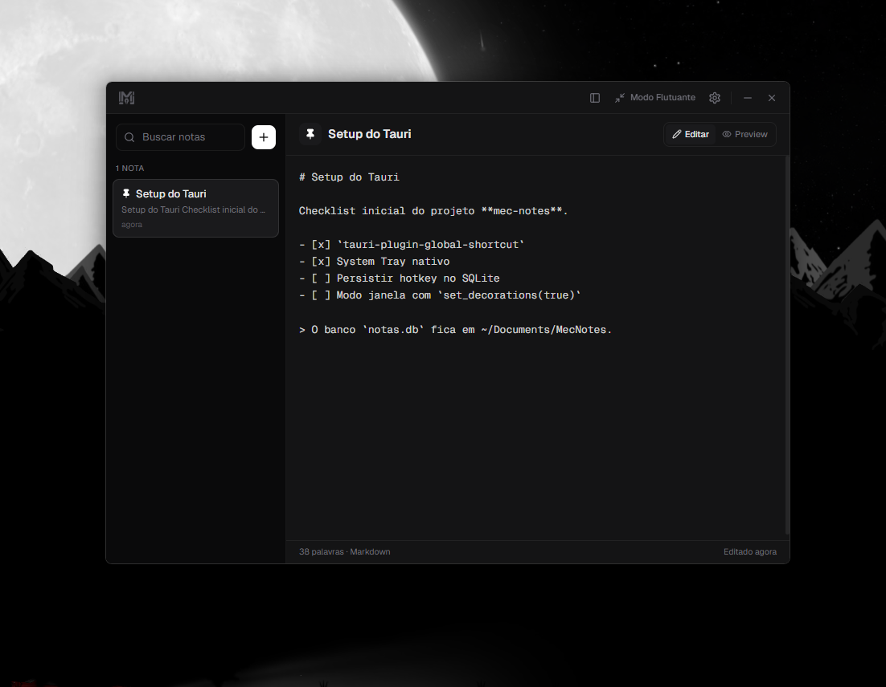

# Mec Notes

Um aplicativo moderno, rápido e leve de **Bloco de Notas Flutuante para Windows**, construído com **Tauri v2**, **Rust**, **React**, **TypeScript**, **Tailwind CSS** e **SQLite**.

Projetado para captura rápida de notas, suporte a Markdown, atalhos globais personalizáveis e integração nativa com o Windows (System Tray e fixação na tela).

<p align="center">
  
</p>

---

## ✨ Funcionalidades Principais

- 🪟 **Modo Flutuante e Modo Janela:**
  - **Flutuante:** Janela compacta, sem bordas/decorações, fixada no canto inferior direito (*Always on Top*).
  - **Janela Padrão:** Janela expandida centralizada com decorações nativas do Windows.
- ⌨️ **Atalho Global de Sistema (Global Hotkey):**
  - Exiba ou oculte a aplicação instantaneamente de qualquer lugar (padrão: `Ctrl+Shift+Space`).
  - Atalho reconfigurável com persistência no banco.
- 📥 **Bandeja do Sistema (System Tray):**
  - Ícone na barra de tarefas/bandeja com menu de contexto (*Abrir Notas*, *Ocultar*, *Sair*) e toggle no clique simples.
- 💾 **Persistência SQLite em `~/Documents`:**
  - Banco de dados SQLite local salvo automaticamente em `C:\Users\<SeuUsuario>\Documents\MecNotes\notas.db`.
- 📝 **Editor Markdown com Auto-Save:**
  - Suporte completo a Markdown (títulos, listas, checkboxes, citações, formatação inline).
  - Salvamento automático com debounce em tempo real.
  - Fixação de notas no topo (*Pin*) e pesquisa por título/conteúdo.
- 🔄 **Backup e Restauração:**
  - Exportação e importação do banco de dados completo (`.db`) com diálogo nativo de arquivos.

---

## 🛠️ Tecnologias Utilizadas

- **Backend Desktop:** [Tauri v2](https://v2.tauri.app/) + [Rust](https://www.rust-lang.org/)
- **Banco de Dados:** [rusqlite](https://crates.io/crates/rusqlite) (SQLite Embutido)
- **Frontend:** [React 18](https://react.dev/) + [TypeScript](https://www.typescriptlang.org/) + [Vite](https://vitejs.dev/)
- **Estilização & UI:** [Tailwind CSS](https://tailwindcss.com/) + [Lucide Icons](https://lucide.dev/) + [react-markdown](https://github.com/remarkjs/react-markdown)

---

## 📋 Pré-requisitos

Para rodar ou compilar o projeto, certifique-se de ter instalado:

1. **[Node.js](https://nodejs.org/)** (v18 ou superior) + npm
2. **[Rust & Cargo](https://www.rust-lang.org/tools/install)**
3. **C++ Build Tools:** No Windows, instale as ferramentas de compilação do C++ via *Visual Studio Installer* (C++ build tools).

---

## 🚀 Como Executar o Projeto

### 1. Instalar Dependências

No diretório raiz do projeto:

```bash
npm install
```

### 2. Rodar em Modo de Desenvolvimento (Desktop Completo)

Inicia o servidor Vite e abre a janela do aplicativo Tauri com *Hot Reload*:

```bash
npm run tauri dev
```

### 3. Rodar Apenas o Frontend no Navegador (Opcional)

Para testes visuais rápidos no navegador (recursos nativos do Rust/SQLite ficam mockados/desabilitados):

```bash
npm run dev
```
Acesse: `http://localhost:1420`

---

## 🧪 Testes

### Executar Testes Unitários do Backend (Rust/SQLite):

```bash
cargo test --manifest-path src-tauri/Cargo.toml
```

---

## 📦 Build e Distribuição

Você pode compilar os instaladores para as arquiteturas **64-bit (x64)** e **32-bit (x86)**:

### 1. Preparar suporte para 32-bit (apenas na primeira vez):
```bash
rustup target add i686-pc-windows-msvc
```

### 2. Gerar Instaladores e Executáveis:

- **Build 64-bit (x64):**
  ```bash
  npm run build:x64
  ```
  *Artefato NSIS:* `src-tauri/target/x86_64-pc-windows-msvc/release/bundle/nsis/`

- **Build 32-bit (x86):**
  ```bash
  npm run build:x86
  ```
  *Artefato NSIS:* `src-tauri/target/i686-pc-windows-msvc/release/bundle/nsis/`

- **Build de Ambas as Arquiteturas:**
  ```bash
  npm run build:all
  ```

---

## ⌨️ Atalhos Padrão

| Atalho | Ação |
| :--- | :--- |
| `Ctrl + Shift + Space` | Alternar visibilidade da janela (Global) |
| `Ctrl + N` | Criar nova nota |
| `Ctrl + B` | Alternar barra lateral (Sidebar) |

---

## 📂 Estrutura do Projeto

```
mec-notes/
├── src/                    # Frontend (React + TypeScript + Tailwind)
│   ├── components/         # Componentes UI (Editor, Sidebar, Titlebar, Settings)
│   ├── services/           # Comunicação IPC com o backend Tauri (dbService)
│   ├── App.tsx             # Estado principal e lógica da aplicação
│   └── main.tsx            # Ponto de entrada do React
├── src-tauri/              # Backend (Rust + Tauri v2)
│   ├── src/
│   │   ├── db.rs           # Camada SQLite, migrações e persistência
│   │   ├── lib.rs          # Comandos IPC, System Tray e Atalhos Globais
│   │   ├── main.rs         # Inicialização do executável
│   │   └── tests.rs        # Testes unitários do SQLite
│   ├── Cargo.toml          # Dependências Rust
│   └── tauri.conf.json     # Configurações do Tauri (janelas, permissões, etc.)
└── package.json            # Scripts e dependências do Node.js
```
